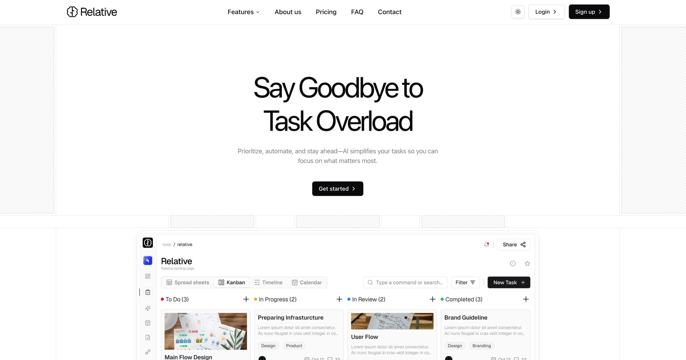

# Relative NextJS Template

Relative NextJS Template is a premium template built by https://www.shadcnblocks.com

- [Demo](https://relative-nextjs-template.vercel.app/)

## Screenshot



## Getting Started

```bash
npm install
```

```bash
npm run dev
```

Open [http://localhost:3000](http://localhost:3000) with your browser to see the result.

## Tech Stack

- Nextjs 15 / App Router
- Tailwind 4
- shadcn/ui

## Deploy on Vercel

The easiest way to deploy your Next.js app is to use the [Vercel Platform](https://vercel.com/new?utm_medium=default-template&filter=next.js&utm_source=create-next-app&utm_campaign=create-next-app-readme) from the creators of Next.js.

Check out our [Next.js deployment documentation](https://nextjs.org/docs/app/building-your-application/deploying) for more details
